# Sistema de Gestión para Taller de Costura

## Integrantes

- Carolina Fetta
- Delfina Ibañez
- Candela Aguilar

---

## Descripción del proyecto

Sistema web para la gestión integral de un taller de costura.  
Permite registrar clientes con sus medidas, gestionar encargos con seguimiento de estados, registrar pagos y señas, calcular saldos pendientes, y recibir alertas sobre vencimientos y estados críticos.

---

## Tecnologías utilizadas

| Capa | Tecnología |
|---|---|
| Frontend | HTML5, CSS3, JavaScript |
| Backend | PHP 8 |
| Base de datos | MySQL 8 |
| Servidor local | WAMP / XAMPP |

---

## Justificación del Stack

**JavaScript** se eligió para el frontend por su capacidad de generar interfaces dinámicas sin recargar la página, especialmente útil para el manejo de encargos y alertas en tiempo real.
 
**PHP** fue seleccionado para el backend por su integración sencilla con MySQL y su adecuación natural para sistemas CRUD con arquitectura MVC.
 
**MySQL** permite estructurar las relaciones entre clientes, encargos, pagos, observaciones y alertas de forma robusta y con integridad referencial.
 
El sistema se plantea como aplicación web para permitir el acceso desde distintos dispositivos sin instalación adicional.

---

## Requisitos

- PHP 8 o superior
- MySQL 8
- WAMP o XAMPP
- Navegador web moderno

---

## Instalación

### 1. Clonar repositorio

```bash
git clone https://github.com/UCH-LDS-2026/grupo-06
```

### 2. Configurar base de datos

- Crear la base de datos en MySQL (el script la crea automáticamente si no existe)
- Importar el archivo:

```
taller_costura/database/sistema_costura.sql
```

Esto crea todas las tablas e inserta datos de ejemplo listos para probar.

### 3. Configurar conexión

Crear el archivo `taller_costura/config/database.php` con las credenciales locales (este archivo está excluido del repositorio por `.gitignore`):

```php
<?php
define('DB_HOST', 'localhost');
define('DB_PORT', '3306');
define('DB_USER', 'root');
define('DB_PASS', '');
define('DB_NAME', 'sistema_costura');
```

### 4. Iniciar servidor

Con WAMP o XAMPP, iniciar Apache y MySQL.

### 5. Acceder al sistema

```
http://localhost/grupo-06/taller_costura/views/auth/login.php
```

> ⚠️ Si la URL no responde, verificar que la carpeta `grupo-06` esté dentro de `www/` (WAMP) o `htdocs/` (XAMPP).

---

## Credenciales de prueba

| Campo | Valor |
|---|---|
| Email | admin@taller.com |
| Contraseña | Admin1234 |

> ⚠️ La contraseña está hasheada en la base de datos. Si el login falla, correr `actualizar_pass.php` **una sola vez** desde el navegador para regenerar el hash, y luego eliminar ese archivo.

---

## Screenshots

### Login
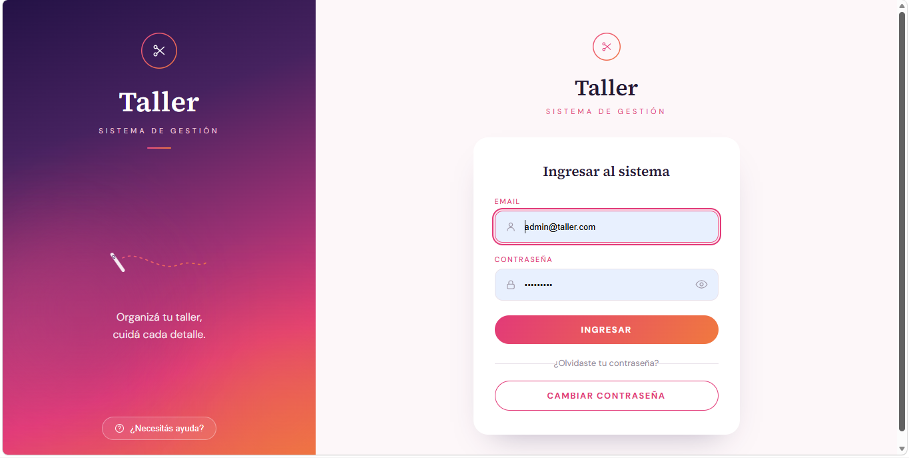 

### Panel de encargos
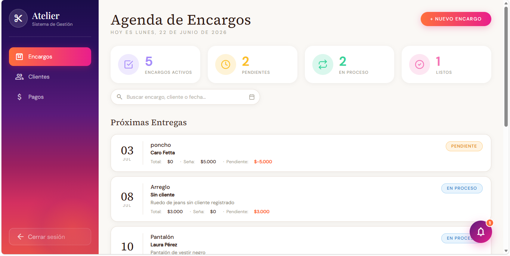
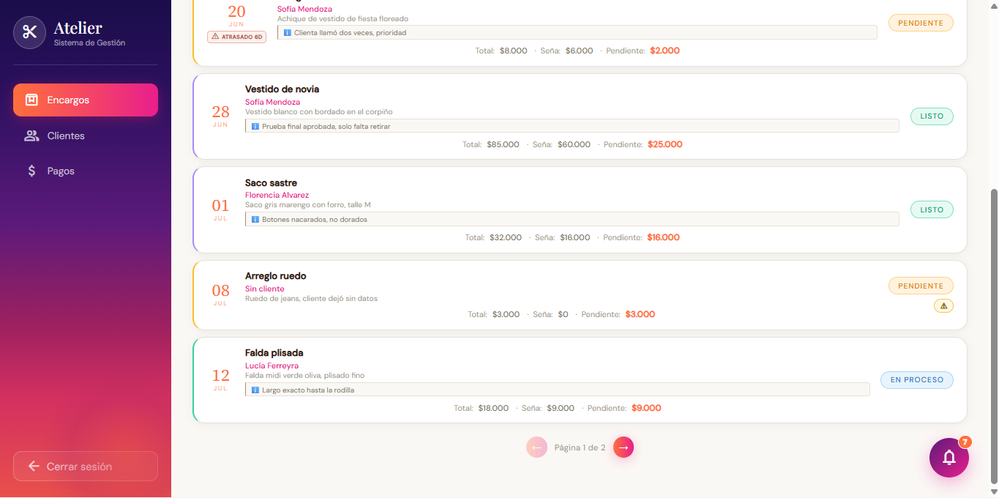

### Detalle de encargo
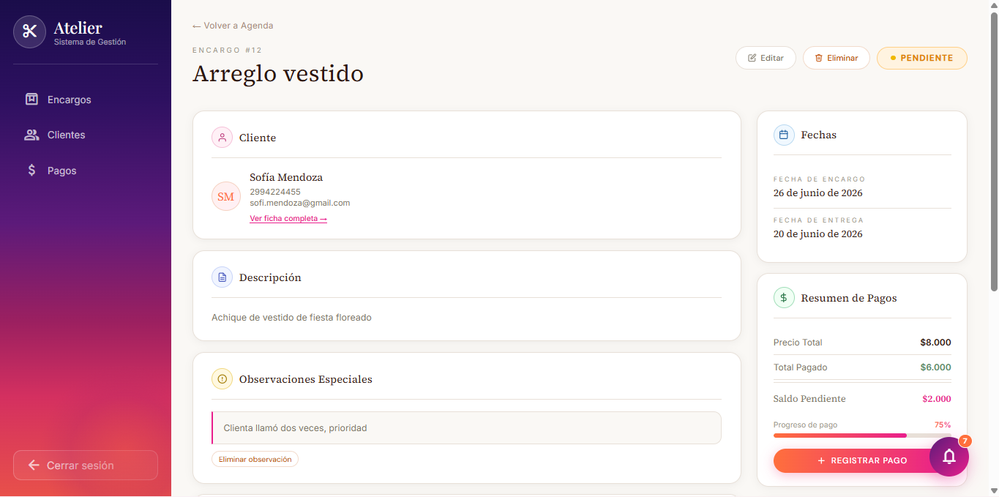
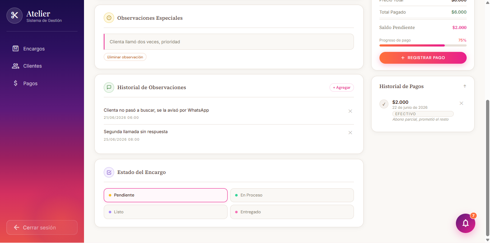

### Fichas de clientes
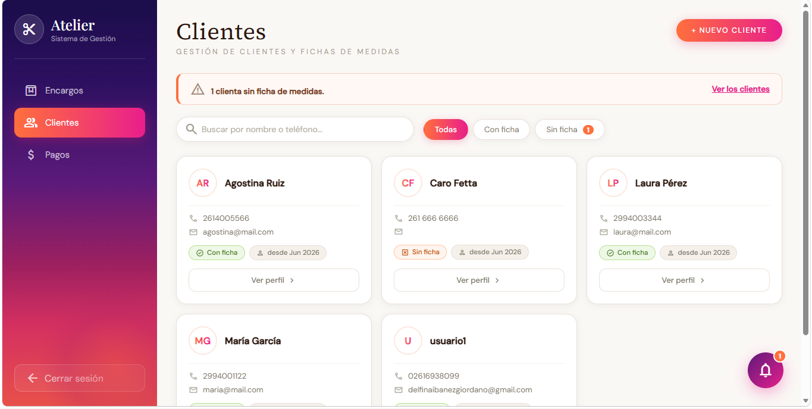

### Detalle de clientes
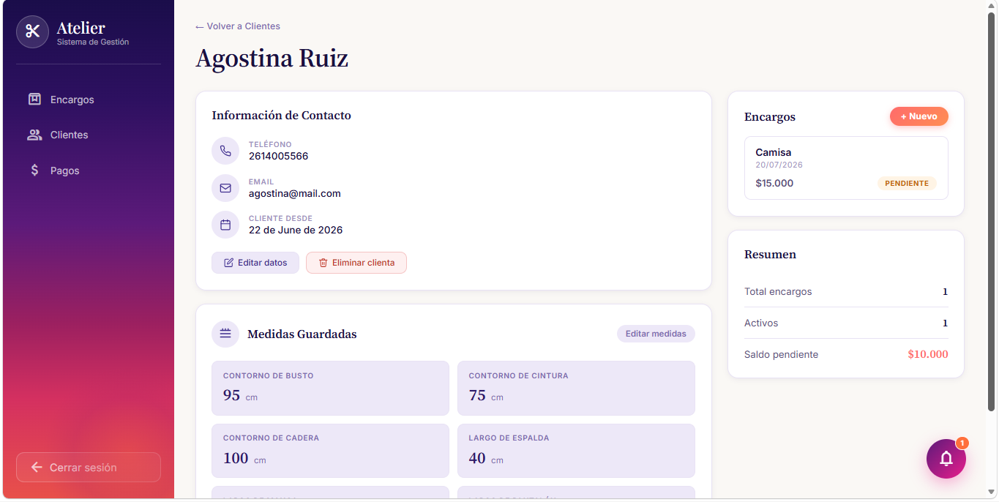
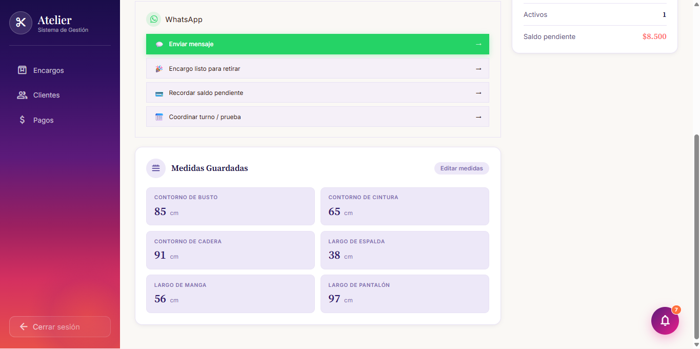

### Nuevo Cliente
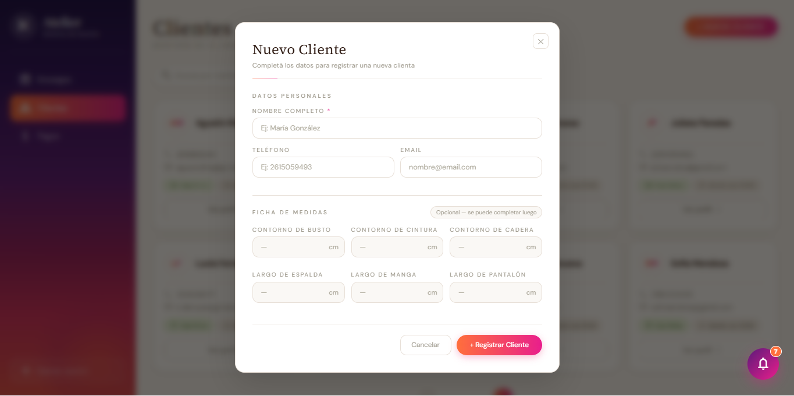

### Módulo de pagos
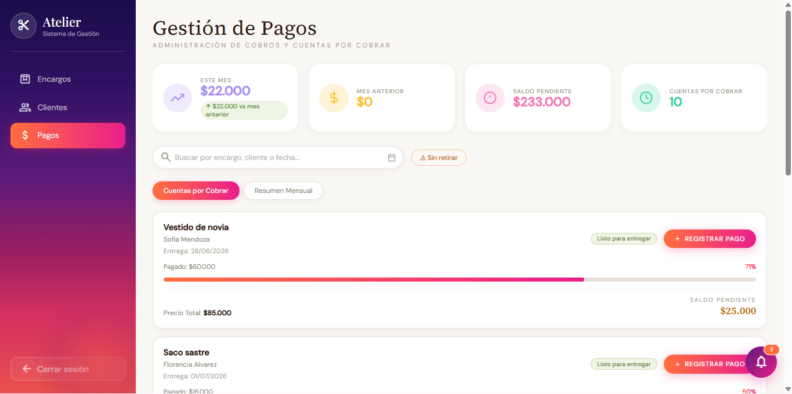

### Registro de pagos
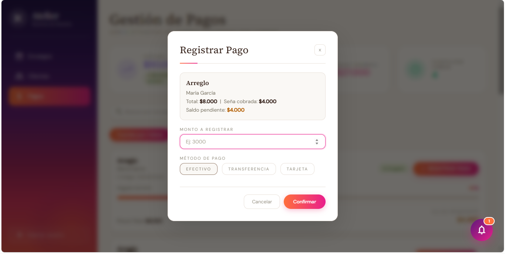

### Alertas
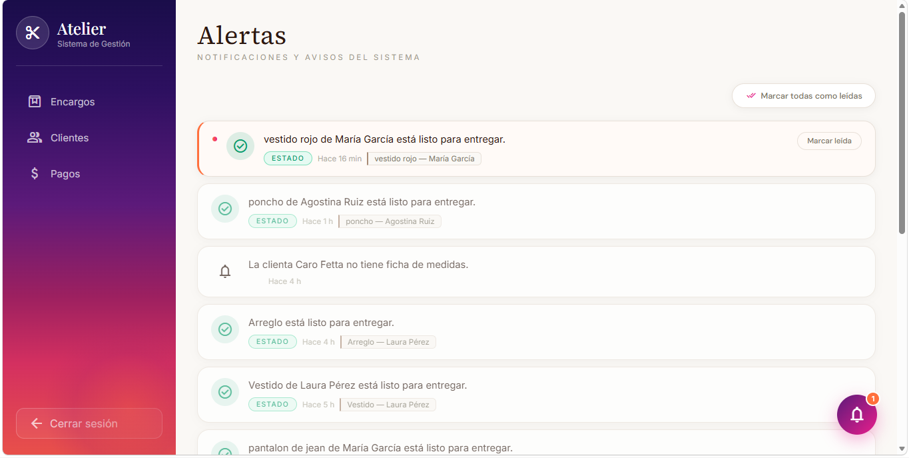

---

## Arquitectura — MVC

```
taller_costura/
├── config/
│   ├── config.php
│   └── database.php          # ⚠️ No se sube al repo (credenciales locales)
├── controllers/
│   ├── AuthController.php
│   ├── ClienteController.php
│   ├── EncargoController.php
│   ├── ajax_encargos.php
│   ├── AlertaController.php
│   └── PagoController.php
├── models/
│   ├── Administrador.php
│   ├── Cliente.php
│   ├── FichaCliente.php
│   ├── Encargo.php
│   ├── Observacion.php
│   ├── Alerta.php
│   └── Pagos.php
├── views/
│   ├── auth/
│   ├── clientes/
│   ├── encargos/
│   ├── alertas/
│   ├── pagos/
│   └── layout/
├── public/
│   ├── css/
│   │   ├── login.css
│   │   ├── sidebar.css
│   │   ├── encargos/
│   │   ├── cliente/
│   │   ├── pagos/
│   │   └── alertas/
│   └── js/
│       ├── encargos/
│       └── cliente/
├── database/
│   └── sistema_costura.sql
└── index.php
```

---

## Funcionalidades implementadas

- **Autenticación**: Login con hash seguro (bcrypt), sesiones PHP, logout
- **Clientes**: Alta, listado, ficha con medidas (talle, pecho, cintura, cadera, manga, espalda, pantalón)
- **Encargos**: Crear, listar, ver detalle, editar, cambio de estado
- **Estados de encargo**: `pendiente → en_proceso → listo → entregado`
- **Pagos**: Registro de señas y pagos parciales por encargo, cálculo de saldo pendiente, métodos: efectivo / transferencia / tarjeta
- **Observaciones**: Notas internas por encargo
- **Alertas**: Notificaciones automáticas por vencimiento, cambio de estado y pagos pendientes; marcado como leída

---

## Modelo de datos

| Tabla | Descripción |
|---|---|
| `administrador` | Usuario único del sistema (costurera) |
| `cliente` | Clientes del taller |
| `ficha_cliente` | Medidas de cada cliente (relación 1:1 con cliente) |
| `encargo` | Encargos con tipo, descripción, fecha de entrega, monto, seña y estado |
| `observacion` | Notas internas asociadas a un encargo |
| `alerta` | Alertas de vencimiento, estado y pago por encargo |
| `pago` | Pagos registrados contra un encargo |

---

## Estrategia de ramas

| Rama | Uso |
|---|---|
| `main` | Versión estable — protegida, solo merge por PR |
| `development` | Integración de funcionalidades |
| `feature/nombre-feature` | Nuevas funcionalidades |
| `fix/nombre-fix` | Corrección de errores |

---

## División de tareas

| Integrante | Módulo | Archivos principales |
|---|---|---|
| Delfina Ibañez | Autenticación & Clientes | `Administrador.php`, `Cliente.php`, `FichaCliente.php`, `AuthController.php`, `ClienteController.php`, `views/auth/`, `views/clientes/` |
| Carolina Fetta | Encargos | `Encargo.php`, `Observacion.php`, `EncargoController.php`, `ajax_encargos.php`, `views/encargos/` |
| Candela Aguilar | Pagos, Alertas & Infraestructura | `Pagos.php`, `Alerta.php`, `PagoController.php`, `AlertaController.php`, `config/`, `index.php`, `.htaccess`, `views/layout/`, `views/pagos/`, `views/alertas/` |

---

## Diagramas

> 📁 Carpeta: `/docs/`

- `Diagrama de caso de uso (1).png` — Casos de uso del sistema
- `Diagrama_de_Clases.drawio.webp` — Diagrama de clases

---

## Objetivo del proyecto

Digitalizar la organización de un taller de costura para evitar pérdidas de información, mejorar el control de entregas y facilitar la gestión de clientes y pagos.